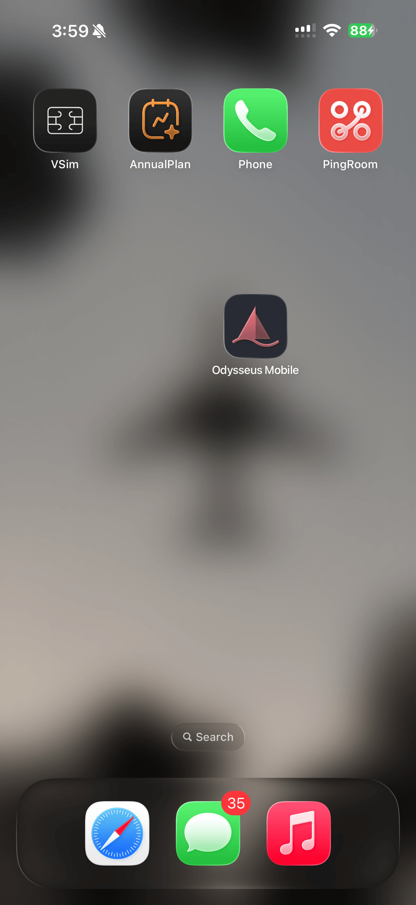
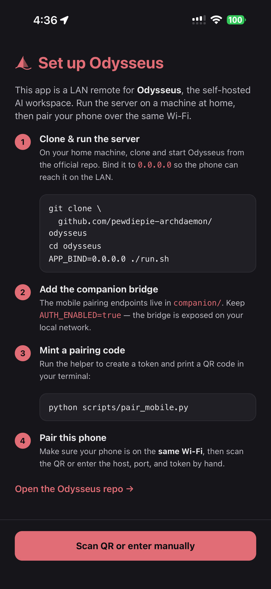
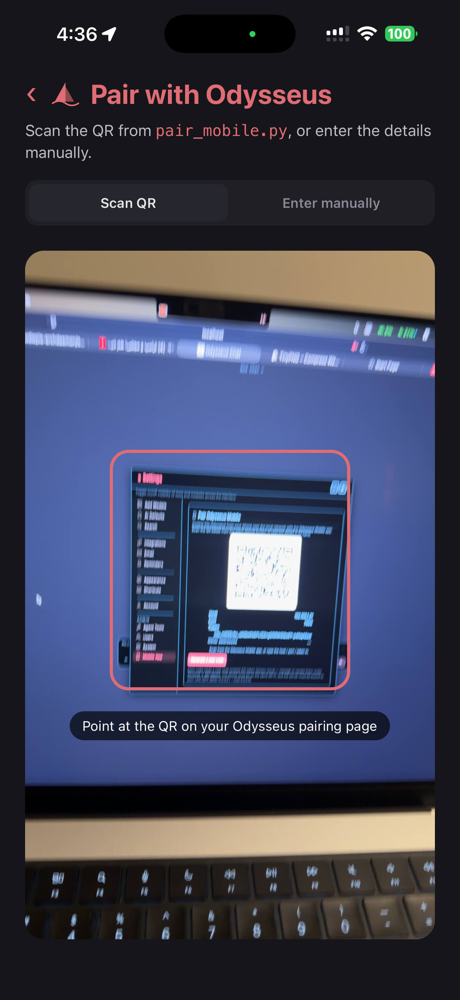
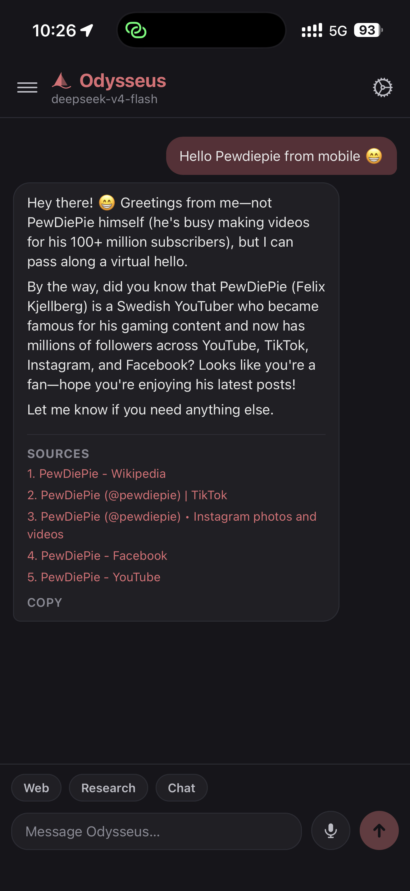
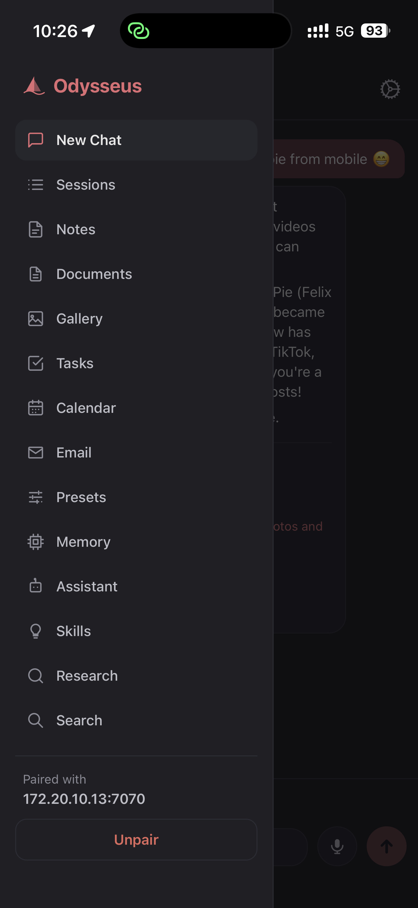
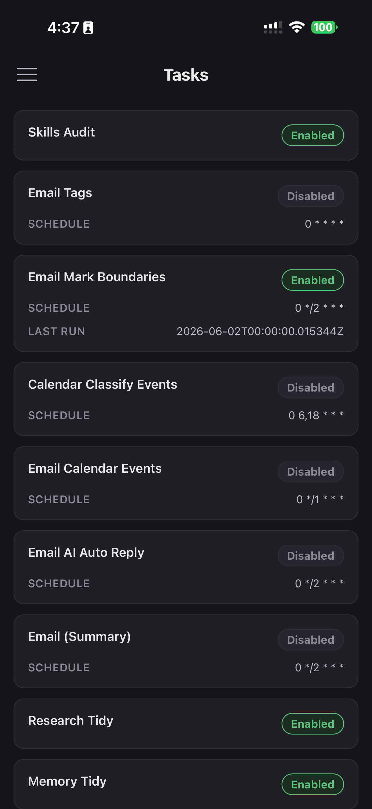

<p align="center">
  
</p>

# Odysseus Mobile

**Version 1.0.0**

A native iOS/Android remote for [**Odysseus**](https://github.com/pewdiepie-archdaemon/odysseus),
the self-hosted AI workspace. Run Odysseus on a machine at home, pair your phone
over the same Wi-Fi, and chat with your own models — local-first, nothing leaves
your network.

Built with **Expo SDK 56** (React Native 0.85, React 19, expo-router).

<p align="center">
  
  &nbsp;&nbsp;
  
  &nbsp;&nbsp;
  
</p>
<p align="center">
  
  &nbsp;&nbsp;
  
  &nbsp;&nbsp;
  
</p>

## Install

### iOS — TestFlight

1. Install Apple's **[TestFlight](https://apps.apple.com/app/testflight/id899247664)** app.
2. Open **[testflight.apple.com/join/qWq1A51n](https://testflight.apple.com/join/qWq1A51n)** and tap *Install*.

### Android — APK

Download **[`odysseus-mobile-v1.0.0.apk`](https://github.com/mahdi-salmanzade/odysseus-mobile/releases/latest)**
from the latest release and install it (allow *install from unknown sources* if
prompted).

> Either way, you'll need an Odysseus server on your LAN with the companion
> bridge — see [Prerequisites](#prerequisites) and [Pairing](#pairing) below.

## A note to the community (and to PewDiePie) 🙏

Huge thanks to **PewDiePie** for building and open-sourcing
[Odysseus](https://github.com/pewdiepie-archdaemon/odysseus) — a genuinely
local-first, privacy-first AI workspace, with no Trojan horse. This little app
exists only because that one does. Thank you, Felix. 🛶

This project is **meant to be public and free** — take it, fork it, run it. If I
see people actually using it, I'll keep it alive: shipping the latest features,
keeping it in step with Odysseus, and **publishing it on the App Store** so it's
a one-tap install instead of a dev build. So if it's useful to you, a star or a
note goes a long way toward deciding what comes next. ❤️

## How it works

The phone authenticates to your Odysseus server with an `ody_` API token and
talks to it directly over the LAN. Pairing data — `{ host, port, token }` — is
stored only on-device in the iOS/Android keychain (`expo-secure-store`).

```
 ┌─────────────┐    Wi-Fi / LAN     ┌──────────────────────────┐
 │  Odysseus    │  http://ip:7000    │  Odysseus Mobile (Expo)  │
 │  Mobile app  │ ◀───────────────▶ │  pair → chat → stream    │
 └─────────────┘   Bearer ody_…     └──────────────────────────┘
```

Model discovery uses Odysseus's **companion bridge** (`/api/companion/*`);
sessions and streaming chat use the stock Odysseus API (`/api/session`,
`/api/chat_stream`).

## Prerequisites

1. **Odysseus running with the companion bridge** (the `companion/` package and
   `/api/companion/*` routes).
2. **Server reachable on your LAN** — bind to `0.0.0.0`, not just loopback:
   - Docker: set `APP_BIND=0.0.0.0` in `.env`, `docker compose up -d`.
   - Native: launch with `--host 0.0.0.0`.
3. Phone and server on the **same network**.

## Pairing

On the server, while logged in as admin, open:

```
http://localhost:7000/api/companion/pair
```

Scan the QR with this app (or use **Enter manually** and type host / port /
token). Or mint a code from the terminal:

```bash
python scripts/pair_mobile.py
```

## Develop

```bash
npm install
npx expo start
```

> Cleartext `http://` to a LAN IP is allowed via `app.json` (`usesCleartextTraffic`
> on Android, ATS exceptions on iOS). These need a **development build** — SDK 56
> apps don't run in the legacy Expo Go on the stores. Use `npx expo run:ios` /
> `npx expo run:android`, or an EAS dev build, on a device that's on your Wi-Fi.

## Server setup & TestFlight

- **Setting up the server + connecting your phone:** see
  [`MOBILE_SETUP.md`](https://github.com/pewdiepie-archdaemon/odysseus/blob/main/MOBILE_SETUP.md)
  on the Odysseus server side.
- **Building for TestFlight / the App Store:** see [`TESTFLIGHT.md`](TESTFLIGHT.md).

## Project layout

```
src/
  app/
    _layout.tsx     # providers + pairing-gated Stack
    index.tsx       # chat screen (model discovery, session, SSE streaming)
    sessions.tsx    # session list
    notes.tsx       # notes (text + checklists)
    tasks.tsx       # scheduled tasks
    memory.tsx      # memories
    pair.tsx        # QR scan / manual pairing
    settings.tsx    # server info + unpair
  components/        # sidebar, markdown, qr-scanner, header-icons,
                     # nav-icon, odysseus-logo, odysseus-wordmark
  lib/
    api.ts          # Odysseus wire contract + SSE stream reader
    pairing.ts      # Pairing type + secure-store persistence
    pairing-context.tsx
    sidebar-context.tsx
    prefs.ts        # persisted user prefs (e.g. selected model)
  constants/theme.ts
```

## Permissions

The app declares only what it needs, each with a clear purpose string:

- **Camera** — scan the pairing QR code shown by your Odysseus server.
- **Photo Library** — read a stored screenshot to scan a QR code you've saved.
  (Also linked by the camera SDK, so iOS requires the string even if you never
  pick from the library.)
- **Microphone** + **Speech Recognition** — optional on-device speech-to-text
  for composing a message by voice.
- **Local Network** — reach your Odysseus server over the LAN.

None of these send data anywhere but your own server. You can decline any of them
and still pair manually and chat by typing.

## Security

The pairing token grants chat access to your Odysseus. It lives only in this
device's keychain and is sent as a Bearer token over your LAN. Revoke it anytime
in **Odysseus → Settings → API tokens**. For access beyond a trusted home
network, put Odysseus behind HTTPS (see the Odysseus README).

## License

MIT
