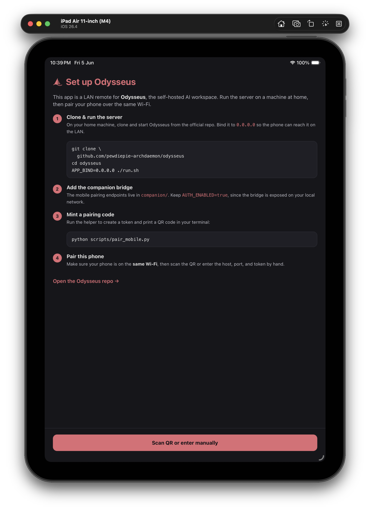
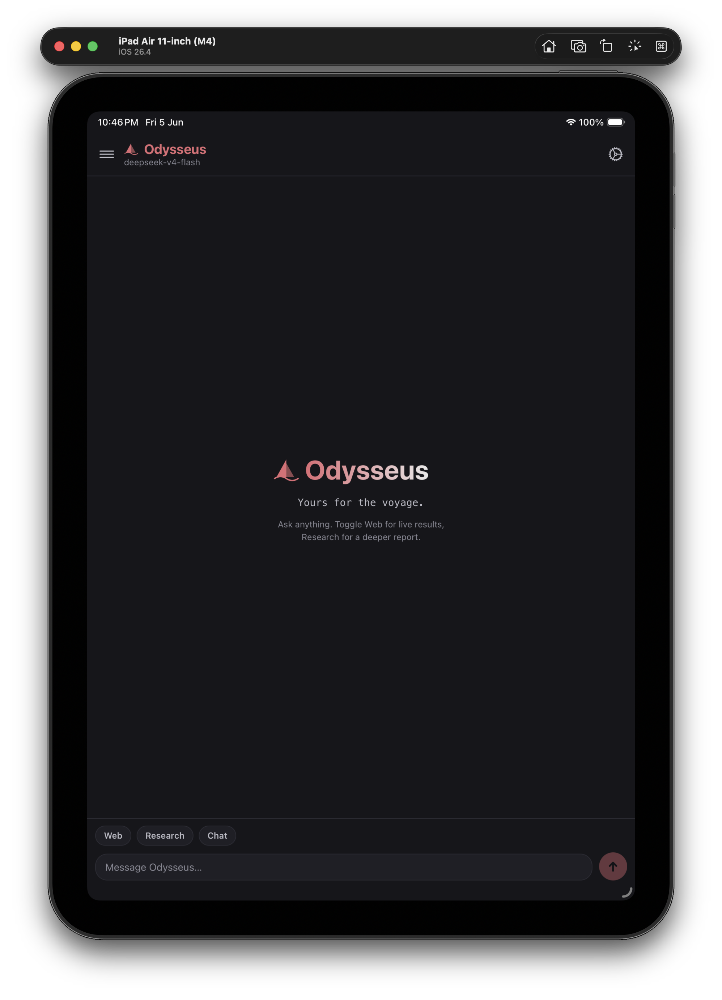
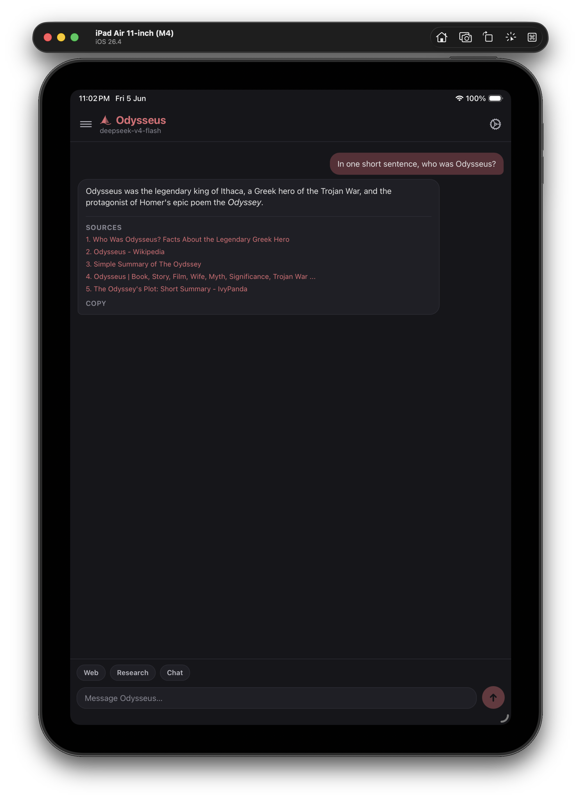

# iPad screenshots

Odysseus Mobile runs as a single universal build on **iPhone and iPad**
(`ios.supportsTablet: true`). On iPad it uses the full screen rather than a
scaled-up phone layout. Captured on an iPad Air 11-inch (M4).

  
  &nbsp;
  
  &nbsp;
  

> These are full-resolution iPad captures, so they're kept here rather than in
> the [main README](../README.md) to keep that page light.
